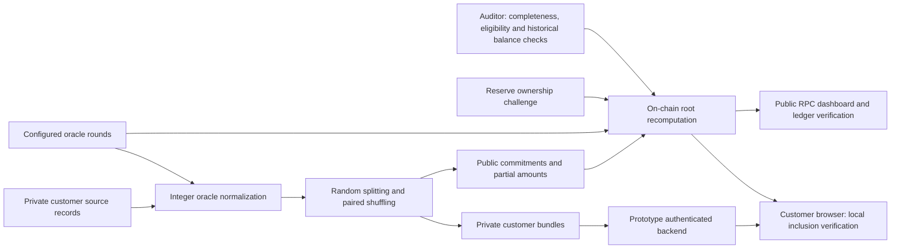

# Minimum publicly verifiable solvency prototype

The claim is **eligible verified assets in USD >= verified total liabilities in
USD**. `MinimumSolvencyRegistry` is the audited registry used by the frontend,
operator CLI and local deployment workflow. This branch contains only this
solution; earlier implementations remain in Git history and on other branches.

## Components and data flow



* `prover/minimum/tree.ts`: browser-compatible domain-separated ABI hashing,
  canonical ledger, fixed capacity, proof verification and integer serialization.
* `build.ts`: Node cryptographic randomness, splitting, pair shuffling and bundles.
* `oracle.ts`, `pipeline.ts`: oracle interface, deterministic mock, conversion
  records, canonical manifest and conversion-before-splitting workflow.
* `contracts/AuditedAssets.sol`: company, reserve owner and auditor roles.
* `MinimumTree.sol`, `SnapshotOracle.sol`, `MinimumSolvencyRegistry.sol`: matching
  hashes, validated feed rounds, state machines and immutable historical claims.
* `backend/server.ts`: one mapped bundle per authenticated principal, no static
  private directory or customer-list endpoint.
* `frontend/`: existing restrained visual style; public, customer and auditor views.
* `cli/minimum.ts`: private preparation, public ledger audit, private reconciliation.
* `script/minimum-local.ts`: deploy and operate a complete disposable local demo.

## Tree and privacy format

Every domain is `keccak256(UTF8("solvency.minimum.v1." + name))` as a `bytes32`.
All hash encodings use **`abi.encode`**, never packed strings. Snapshot IDs, salts,
nonces and hashes are bytes32. Indices, positions, balances and sums are uint256.

```
I = keccak256(abi.encode(D_identity, snapshotId, customerId:string,
                        dateOfBirth:string, partIndex:uint256, salt, nonce))
left = (I, 0)
B = keccak256(abi.encode(D_balance, snapshotId, pairPosition:uint256, amount:uint256))
right = (B, amount)
pair.hash = keccak256(abi.encode(D_pair, I, uint256(0), B, amount))
pair.sum = amount
parent.hash = keccak256(abi.encode(D_node, left.hash, left.sum, right.hash, right.sum))
parent.sum = left.sum + right.sum
```

Customer strings are exact UTF-8 strings; no implicit normalization or date
conversion occurs. Customers supply the expected ID, DOB and full balance from
independent records. Never trust the bundle's `expectedBalance` alone.

Each positive full balance is divided into a cryptographically random number of
positive integer parts in `[minParts, maxParts]`, capped by the balance in smallest
USD units. Defaults are 2–4 parts. Every salt and nonce is independently generated
with Node's CSPRNG; duplicate random secrets are rejected across the whole build.
All **pairs** are shuffled with a cryptographic Fisher–Yates shuffle. Identity and
balance children are never independently shuffled. Generation rejects duplicate
customer IDs, overflow, capacity exhaustion and insufficient amounts for the
minimum number of positive parts. Zero-balance accounts are not supported by the
customer-inclusion workflow; an empty aggregate ledger is supported.

Capacity is a deployment-wide power of two from 2 to 256 pairs (default builder
64; demo 16). A capacity of 256 supports at most 128 customers with a two-part
minimum. The tree always has `2 * capacity` identity/balance leaves, `capacity`
pair parents and `log2(capacity)` sibling steps per proof. Unused trailing positions
have amount zero and identity
`keccak256(abi.encode(D_padding, snapshotId, pairPosition:uint256))`.
They use the same balance/pair hashes as real positions. Real parts must be positive.

Canonical public `ledger.json`:

```
{ version: 1, snapshotId, capacity, padding: "trailing-domain-v1",
  pairs: [{identity: bytes32, amount: unsignedDecimalString}, ...],
  rootHash: bytes32, rootSum: unsignedDecimalString }
```

Array order defines pair positions. Only real pairs are serialized; padding is
reconstructed deterministically. The ledger is also available through the
`PublicLedger` event and transaction calldata. No customer identifiers, DOBs,
salts, nonces, part indices or customer mappings are published. Public verifiers
recompute the same root and sum; the contract does so itself on submission and
rejects an unrelated supplied total. Shared synthetic fixtures test all encodings,
field orders, domains, padding, the root sum and the rate-manifest hash in TS/Solidity.

Private bundles include snapshot, ID, DOB, expected full balance, capacity, root,
root sum, and every part's index, salt, nonce, amount, pair position, sibling hashes,
sibling sums and path bits. Verification checks all openings and paths, unique
indices/positions/secrets, contiguous indices, exact depth, positive parts, uint256
bounds, the independently supplied identity/full balance and current on-chain
anchor. Missing positive parts fail the full-balance check. A customer cannot
detect secret reuse in another customer's private bundle; the builder enforces
that globally. Public observers cannot inspect openings to check it themselves.

Splitting and capacity **do not mathematically hide customer count**. Real part
count is visible. Amounts, usage patterns and outside information may allow
customer-count estimates or linking. Sibling sums disclose partial subtree totals.
The sequential random partition algorithm is not claimed to produce a uniform
distribution over every possible composition of a balance.

## USD conversions and oracle manifest

`USD_SCALE = 100000000` (8 decimals); all monetary arithmetic uses BigInt/uint256.
For raw amount `a`, token decimals `t`, positive oracle answer `p` and feed decimals `d`:

```
numerator = a * p * 10^8
USD liability = ceil(numerator / 10^(t+d))
USD reserve   = floor(numerator / 10^(t+d))
```

Rounding is conservative. Token/feed decimals must be integers 0–18. Every
intermediate multiplication and sum must fit uint256; values whose intermediate
product overflows are rejected even if their mathematical quotient would fit.
Supported assets are explicitly supplied through the oracle adapter/configuration.
Native currency uses `0xEeeeeEeeeEeEeeEeEeEeeEEEeeeeEeeeeeeeEEeE` with 18 decimals;
all other tokens must expose matching `decimals()` and `balanceOf(address)`.

Each private conversion record preserves token, raw amount, token decimals, feed,
answer, feed decimals, round ID, updated-at timestamp and calculated USD. The public
manifest contains unique rates sorted numerically by token address, without raw
customer amounts or customer identity. It is committed as:

```
keccak256(abi.encode(D_rates, snapshotId,
  Rate[]({address token,address feed,uint8 tokenDecimals,uint8 oracleDecimals,
          uint256 rate,uint80 roundId,uint256 updatedAt})))
```

The contract stores the entire manifest and hash on the liability; claims copy
the same hash. Oracle interfaces are Chainlink-compatible `decimals()` and
`getRoundData(uint80)`. Submission and finalization verify the actual recorded
round, positive answer, decimals, timestamp and `answeredInRound >= roundId`.
Rounds must predate/equal the snapshot and be no older than `maxOracleAge` at
both snapshot and finalization. Missing, zero, future and stale rounds fail.
Maximum age is immutable, nonzero and at most seven days; the demo uses one hour.
Mock rounds are deterministic, owner-written and immutable once populated; no
live network is used in tests. Mock feeds are exclusively for local demonstrations.

## Roles and state transitions

Company and auditor are immutable, nonzero and different addresses. Customers have
no reserve-management permissions.

| Object | Company action | Reserve / auditor action | Effect |
| --- | --- | --- | --- |
| Asset | `addAsset(token,reserve,feed,nativeAsset)` | Reserve `verifyAsset(id,expiry,signature)` | Pending; ownership separately recorded |
| Eligibility | — | Auditor `approveAsset(id,approved)` | Pending → Approved or Rejected |
| Asset removal | `removeAsset(id)` | Auditor `verifyRemoveAsset(id,approved)` | Retirement only on approval; rejection cancels request |
| Liability | `addLiability(input,identities,amounts,rates)` | Auditor `verifyAddLiability(id,approved)` | Pending → Approved or Rejected |
| Liability removal | `removeLiability(id)` | Auditor `verifyRemoveLiability(id,approved)` | Pending/Approved → Retired only on approval |
| Claim | `proposeClaim(id,assetIds,rawAmounts)` | Auditor `finalizeClaim(id,approved)` | Immutable finalized claim or recorded rejection |

All proposals, decisions, ownership checks, removal requests and finalizations emit
events. Active reserve/token combinations cannot be duplicated. Reserve ownership
can be demonstrated by calling from the reserve, EIP-712 EOA signature or EIP-1271
contract-wallet signature. Ownership challenges bind current chain ID, registry
address, asset ID, nonce and expiry. Signatures enforce canonical `s` and `v`;
nonces increment on success. A verified pending asset still needs separate auditor
eligibility approval. Historical asset records are never erased.

Each liability ID can be used only once. `SnapshotInput` contains ID, root, USD
total, manifest hash, snapshot time and snapshot block. The block must precede
submission by at most 256 blocks, and time must not be in the future or stale.
The auditor verifies that the declared time actually matches the block and that
all liabilities and conversions were disclosed correctly. On-chain code cannot
read an arbitrary historical block timestamp or prove completeness of private data.

Claim asset IDs must be unique and increasing. The company supplies historical
raw balances. **These balances are auditor attestations, not trustless historical
balance proofs.** The auditor view queries native/ERC-20 balances through historical
RPC at the declared block and compares them before enabling approval. Anyone
holding the auditor key can call the contract directly, so that key remains a
trust boundary. The contract itself checks eligibility, ownership, approved
liability state, pending removals, matching token/feed manifest, freshness, checked
USD arithmetic and the solvency inequality. An insolvent proposal cannot finalize.

A removal request does not retire an asset/liability immediately, but blocks new
claim finalization until decided. Claims copy totals, root, snapshot, manifest,
submission/verification times and auditor. Observation records copy raw amounts,
USD amounts, rate indices and attestation time. Later retirements cannot alter
historical claims. The public current claim only advances to a strictly newer
snapshot block; finalizing an older claim cannot roll it back. Getters expose
history, proposals, status, manifests, roles and timestamps.

## Customer authentication and verification

`PrototypeAuthentication` accepts an expiring random 256-bit bearer token. An
operator privately provisions it; the server stores only its SHA-256 hash and
maps it to a customer ID and one private file. This is a clearly labelled prototype
adapter, not production identity management. It has no password-reset, MFA, token
revocation service or production session management. Restart/reload is required
to change the in-memory account list. Custom tokens must be generated randomly.

`GET /api/proof` accepts no customer selector or query string. Invalid/expired
credentials get 401; other paths/methods get 404. Identity mismatch in stored data
fails closed. Responses use `Cache-Control: no-store`; private storage must be
outside the repository (including symlink resolution). The loopback backend does
not serve static files and never logs credentials or bundles. Vite proxies `/api`
and explicitly denies private files. Do not publish the private directory.

The browser retrieves one bundle, then re-reads the current finalized claim and
verifies all parts locally against that anchor. Expected ID, DOB and full balance
stay in the browser. No raw identity or proof is sent to RPC/blockchain. Only the
authentication token is sent to the backend. Redirects are rejected and tokens are
cleared from the input after retrieval. Epoch mismatch gets an explicit outdated
warning. Authentication success alone never produces a valid-inclusion result.

## Auditor workflow

1. Reconcile independent full source records, not only a company-provided list.
   Establish completeness, ownership, encumbrances and eligibility off-chain.
2. Run `minimum audit` on public data and `minimum audit-private` on confidential
   independent records and bundles. Check the manifest against trusted feeds.
3. Inspect the dashboard auditor queue: statuses, ownership, removals, roots,
   totals, manifest, snapshot time/block, actual historical reserve balances,
   fresh rounds and calculated surplus/deficit. Archive RPC access may be required.
4. Connect the appointed auditor wallet to the same chain and sign approve/reject
   decisions. Before finalization the UI requires the historical balance, time,
   freshness and eligibility checks to pass. Legal eligibility and liability
   completeness still require judgment and private reconciliation.

Auditor approval is an attestation, **not a mathematical proof of undisclosed debts**.

## Local setup and deployment

Validated toolchain: Node 26.8.1, npm 12.0.2, TypeScript 7.0.2, Vite 8.2.2,
Solidity 0.8.28, viem 2.56.3 and Foundry 1.8.1. Use a modern Node
release supporting `--test-isolation=none`. Dependencies are recorded in the
lockfile. Install them with `npm ci`; install Foundry separately if absent.
The Solidity optimizer is enabled; deployed registry bytecode is 16,688 bytes,
below the 24,576-byte EVM code-size limit.

From the repository directory:

```bash
npm ci
forge build
npm run abi
```

Terminal 1, disposable local chain (the unlocked accounts are public development
accounts, never fund them on a public network):

```bash
anvil --host 127.0.0.1 --port 8545
```

Terminal 2, use a **new**, absolute directory outside the repository:

```bash
npm run demo:minimum -- /tmp/minimum-demo
MINIMUM_PRIVATE_DIR=/tmp/minimum-demo npm run backend
```

The demo deploys a feed and registry, proves reserve control, approves eligibility,
converts Alice/Bob liabilities, builds private bundles, submits/approves a snapshot,
checks historical reserves and finalizes the claim. It prints the registry address
and auditor address. It writes random expiring credentials to
`/tmp/minimum-demo/credentials.private.json` with private permissions, not into the
frontend. Demo liabilities are Alice 100 USD and Bob 50 USD. Re-running requires a
new directory. The demo refuses non-loopback RPC and any chain ID other than 31337.

Terminal 3:

```bash
npm run dev -- --host 127.0.0.1
```

Open the displayed Vite URL, enter the printed registry address, and read the
claim. For customer verification, inspect the private credentials file locally and
enter one token, ID, DOB and expected balance. For auditor writes, use the second
Anvil account in an injected wallet on chain 31337. The demo has already finalized
its first claim; create additional proposals to exercise decisions interactively.

Independent deployment uses `MinimumSolvencyRegistry(company,auditor,capacity,maxAge)`
and configured trusted feed addresses. Native assets use the sentinel above; token
assets must implement the required ERC-20 reads. Company writes can be made with
`cast send` or a wallet using the generated ABI. Do not reuse local mock feeds or
unlocked demo accounts for any real deployment. No public-network deployment is
performed or claimed by this implementation.

## Private operator commands

Private input JSON (all bigint values are unsigned decimal strings):

```json
{
  "snapshotId": "0x0101010101010101010101010101010101010101010101010101010101010101",
  "snapshotTime": "1000", "snapshotBlock": "9", "maxAge": "60",
  "capacity": 8, "minParts": 2, "maxParts": 4,
  "rates": [{
    "token": "0xEeeeeEeeeEeEeeEeEeEeeEEEeeeeEeeeeeeeEEeE",
    "feed": "0x0000000000000000000000000000000000000010",
    "tokenDecimals": 18, "oracleDecimals": 8,
    "rate": "200000000000", "roundId": "1", "updatedAt": "990"
  }],
  "customers": [{"customerId": "synthetic-example", "dateOfBirth": "2000-01-01",
    "holdings": [{"token": "0xEeeeeEeeeEeEeeEeEeEeeEEEeeeeEeeeeeeeEEeE",
                  "rawAmount": "50000000000000000"}]}]
}
```

This example feed/address/time is synthetic. Replace it with actual configured
on-chain round data and the snapshot block's timestamp before submission.

```bash
npm run minimum -- build /tmp/source.private.json /tmp/new-snapshot
npm run minimum -- audit /tmp/new-snapshot/ledger.json
npm run minimum -- audit-private /tmp/independent-source.private.json /tmp/new-snapshot
```

Only `ledger.json`, `rates.json` and `submission.json` are public. Keep `private/`
confidential. `audit-private` expects source order to match bundle file indices;
that mapping stays private. To use custom bundles with the backend, provision an
`accounts.private.json` array in their private directory with `tokenHash`
(SHA-256 hex of a random 64-character hex bearer token), `customerId`, relative
`bundleFile` and `expiresAt` (Unix milliseconds). Distribute the token out of band.
Never copy private data into the project or frontend public folder.

## Automated validation

```bash
forge build
npm test
npm run test:prover
npx tsc --noEmit
npx vite build
forge fmt --check
forge test
```

`npm test` runs unit/backend/frontend tests followed by an isolated Anvil test on
a temporary loopback port. Build contract artifacts first. It needs permission
to listen on localhost. The test deploys mocks and the registry, finalizes a claim,
recomputes the public ledger through the frontend client, generates private demo
credentials, retrieves a proof over the authenticated backend, and rejects
modified proofs, insolvency and stale rates. The temporary node/files are cleaned
up. `npm run test:prover` runs the minimum Merkle-sum, oracle, pipeline and CLI tests.

Frontend tests exercise rendering, loading/error states, the authentication
boundary, local proofs, wrong identity/balance, tampering and outdated epochs.
They check that retrieval sends no private identity/proof body. They are Node
unit/client tests plus real RPC/HTTP integration, not a browser automation suite.
The production Vite build is checked; visual browser testing is not claimed.

## Recorded validation — 2026-09-10

| Command | Result |
| --- | --- |
| `npm test` | 57 unit/backend/frontend tests + 1 Anvil integration test passed; 0 failed |
| `npm run test:prover` | 46 passed; 0 failed (subset of the 57 above) |
| `npx tsc --noEmit` | Passed |
| `npx vite build` | Passed |
| `forge fmt --check` | Passed |
| `forge build` | Passed; non-fatal style/lint diagnostics remain |
| `forge test` | 32 passed; 0 failed; 5 fuzz tests with 256 runs each |
| `git diff --check` | Passed |

Counts are individual Node tests (`--test-isolation=none`), not test-file counts.
There are 90 distinct tests across the full Node/integration/Foundry runs; the
separate prover command repeats a subset. No tests were skipped.

## Security assumptions and limitations

* Inclusion does not guarantee completeness. The auditor must discover omitted
  accounts, loans and other liabilities through independent records.
* Auditor approval is an attestation, not a proof of undisclosed debts. Historical
  reserve balances and snapshot time/block correspondence are explicitly attested.
* Reserve ownership does not automatically establish asset eligibility, beneficial
  ownership, absence of liens, or exclusivity across other solvency registries.
* Assets may move after the snapshot; this prototype does not lock them.
* Oracle data can become stale. Finalized historical claims remain historical even
  when their rates are no longer current. A dashboard snapshot is not live solvency.
* Authentication is not inclusion. The prototype adapter requires a production
  identity/session system, TLS deployment and operational hardening before real use.
* Capacity and splitting do not guarantee anonymity or mathematically hide counts;
  subtree sums, public part counts, amounts and external data leak information.
* Only positive customer balances and native/standard ERC-20 assets with at most
  18 decimals are supported. Fee/rebasing/encumbered assets need separate review.
* Up to 256 pairs, 32 rate entries and 64 counted reserve assets per claim. This is
  intentionally bounded and recomputes roots on-chain; it is not optimized for
  a large exchange. Claims use a recent-block submission window.
* Company/auditor roles are immutable and cannot be rotated in this prototype.
  One claim proposal per snapshot is allowed; rejected proposals require a new ID.
* RPC endpoints and historical availability are trust/availability dependencies;
  use an independently trusted node. Event retrieval currently starts at genesis
  and the auditor queue enumerates all snapshots; large deployments need pagination.
* No production deployment, regulatory audit, zero-knowledge anonymity guarantee,
  browser automation coverage or live Chainlink-network integration is claimed.
  **This prototype is not production-ready or a regulatory audit.**
